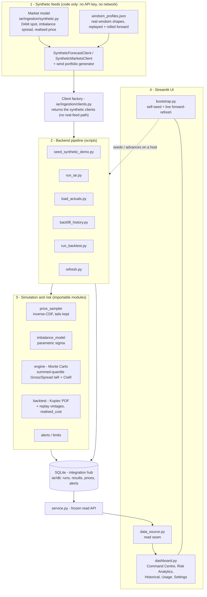

# Imbalance at Risk (IaR) MVP - Demo build

> **This is the DEMO build of the IaR MVP** - it runs on 100% synthetic, market-like data
> (no API key, no private SDKs, no external data, no network at runtime), so it is safe to
> clone, run, and share. The **LIVE build** runs the same product on real feeds (Optimeering
> forecasts, Nord Pool day-ahead prices, windsim positions) and lives in a separate repo:
> **https://github.com/Volue/iarmvp-live**. The two are kept in feature parity; the only
> difference is the data source.

A self-contained demo of an **Imbalance at Risk (IaR)** tool for a wind generation
portfolio. IaR estimates the worst-case imbalance settlement cost at a chosen confidence
level (e.g. the 95th percentile loss) over a forward horizon, via Monte Carlo simulation.
It is the Value-at-Risk analogue for a portfolio's imbalance position in the Nordic and
European balancing market. The euro figures are illustrative (see "Important: illustrative
numbers").

**Hosted version:** https://dashboardpy-tozjybvhqntptotgbyf2tx.streamlit.app/ (click and
explore, nothing to install).

---

## Quick start (about 2 minutes)

Requires **Python 3.11+**. From the repository root:

```bash
python -m venv venv
# Windows:
venv\Scripts\pip install -r requirements.txt
venv\Scripts\python -m streamlit run app/dashboard.py
# macOS / Linux:
# venv/bin/pip install -r requirements.txt
# venv/bin/python -m streamlit run app/dashboard.py
```

Streamlit opens the dashboard in your browser. **On first launch it builds its own
synthetic dataset** (positions, prices, day-ahead history, a live run, and the backtest) —
this takes a minute or two once, then the dashboard is fast and keeps ticking forward while
it is open. No keys, no data files, no extra setup.

Dependencies are all public PyPI packages (numpy, pandas, scipy, SQLAlchemy, Streamlit,
plotly). The `iar` package is imported directly from the repo (the app adds the repo root to
`sys.path`), so no `pip install -e .` is required just to run the demo.

## What you are looking at

A VOLUE-styled "Command Centre" dashboard with six tabs:

- **Overview** - the portfolio-wide landing view: country aggregate KPIs (Gross/Spread IaR vs
  the country limit, utilisation, zones-at-risk, diversification ratio), a per-MBA
  (bidding-zone) grid with status colours so the riskiest zone is obvious, a **View** button
  to drill into any zone, and comparison + diversification charts.
- **Command Centre** — period Gross/Spread IaR vs limits with status, peak-MTU IaR, an
  intraday per-MTU chart, and two heatmaps (forecast worst-case IaR, and realised settled
  cost), plus a limit table and alert feed.
- **Risk Analytics** — risk-profile KPIs (IaR, Expected Shortfall/CIaR with tail ratio,
  peak-MTU IaR, diversification ratio), the IaR-over-time curve vs limit, a Gross-vs-Spread
  comparison, and a per-MTU risk-concentration curve.
- **Historical** — the backtest: realised cost vs the day-ahead IaR estimate, exceedances vs
  the ~5% target, and a Kupiec calibration verdict.
- **Usage** — a short methodology walkthrough of the concept and pipeline.
- **Settings** — basis (Gross/Spread), confidence level, and editable euro risk limits.

## What IaR is (the concept)

A wind portfolio sells volume day-ahead (its DAM position); actual delivery is metered
generation. **Imbalance = DAM position − actual delivery**, settled at the TSO imbalance
price, which is volatile and spikes during system stress. IaR puts a probabilistic number
on that exposure:

- **Gross IaR** — worst-case total settlement cost: position × imbalance price.
- **Spread IaR** — worst-case underperformance vs day-ahead: position × (imbalance price − DAM price).
- **CIaR / Expected Shortfall** — the average loss in the tail beyond IaR.
- **Period IaR** is the quantile of the *summed* P&L across all MTUs in the horizon — not the
  sum of per-MTU IaRs (which would assume every interval has its worst outcome at once).

## Markets and country view

The demo covers all Nordic bidding zones, grouped into countries: **Norway** (NO1-NO5),
**Sweden** (SE1-SE4) and **Finland** (FI, a single zone). A bidding zone, or **MBA (Market
Balance Area)**, is the area within which one imbalance price applies; each zone is modelled
separately, then aggregated.

A country's IaR is **not** the sum of its zones' IaRs - that would ignore diversification (a
bad imbalance hour in one zone rarely coincides with the worst hour in another). The country
figure is the **quantile of the per-scenario cost summed across zones**, which is at most the
naive sum. The **diversification ratio = (sum of zone IaRs) / (country IaR)** measures the
benefit. (In this demo the zones are drawn independently, so the diversification shown is
optimistic; real zones are weather-correlated.)

## Customer input and product decisions (handover record)

**Stakeholder feedback that shaped the product** and how it was addressed:

| Customer ask | Status |
|--------------|--------|
| See the whole portfolio (e.g. all of Sweden) as the starting view | Done - the Overview tab, defaults to the country roll-up |
| When a KPI lights up red, show values per MBA to see which zone carries the risk | Done - per-MBA grid with status colours + comparison charts |
| Drill into a bidding zone for more detail | Done - View buttons + breadcrumb into the zone's tabs |
| Easy limit setting; clear explanation of each figure | Done - Settings (per-zone/country limits) + captions throughout |
| "...and the underlying positions" within a zone | Partial - zones show aggregate position, not per-asset breakdown |
| How does this tie in with intraday (ID) trading? | Not yet - the model uses the day-ahead position only |
| Output to drive ID hedging when a KPI is red | Not yet - the tool measures/flags risk; trade suggestions are future work |

**Key design decisions and why:**

- **Independence assumption** - price and imbalance, prices across MTUs, and zones across a
  country are drawn independently (a deliberate MVP simplification; a copula would slot into
  the `ScenarioDraw` seam later). It biases IaR optimistically low and makes the
  diversification benefit optimistic.
- **Summed-quantile period IaR** (quantile of summed cost, not sum of quantiles) - the
  statistically correct aggregation across time and zones, and the source of the
  diversification ratio.
- **Database as the integration hub + UI behind a thin service layer** - keeps components
  independently testable and the UI source-agnostic, which is exactly why this demo can swap
  real feeds for synthetic ones with no UI changes.
- **Store summaries, regenerate from seed** - runs persist IaR/CIaR + seed, not raw
  scenarios; the country roll-up re-derives per-scenario cost on read.
- **Backtest validity (Kupiec)** - each observation is one settled day, so the test is
  under-powered until many days accumulate; treat it as an indicator, not a verdict.

## How the demo works

```
synthetic feeds  ->  Monte Carlo engine  ->  IaR / CIaR  ->  limits + alerts
(market model)       (10,000 scenarios)      + backtest        + dashboard
```

Everything is generated deterministically from a market-like model, so it is reproducible
and rolls forward in time:

- **Imbalance-price spread forecast** — per-MTU quantiles (P01-P99) from a heavy-tailed,
  skewed distribution.
- **Day-ahead (spot) price** — a diurnal curve with morning/evening peaks and day-to-day
  variation.
- **Realised imbalance price** — day-ahead price plus a drawn spread (so the backtest
  calibrates near the target rate).
- **Wind portfolio** (positions, generation forecast, actual delivery) — replays real
  windsim daily capacity-factor *shapes* (shipped as a small profile file) scaled and rolled
  forward, so it looks like genuine wind data without needing the windsim package.

The Monte Carlo engine samples price and imbalance independently, builds a P&L per scenario,
and reads IaR/CIaR off the summed-P&L distribution. Results are stored in SQLite; the
Streamlit UI reads only through a thin service layer.

This is a synthetic-only build: there is no real-feed code path and no API key. Every feed
is generated in `iar/ingestion/synthetic.py`.

## Architecture

Two principles: **the database is the integration hub** (components never call each other
directly), and **all feeds are synthetic** (there is no real-feed client in this demo).



Read path: `dashboard -> data_source -> service -> SQLite`. Write path: `synthetic feeds ->
factory -> scripts -> engine/risk -> SQLite`. On a host with no database, `bootstrap.py`
runs the pipeline to self-seed, then advances it forward while the app is open.

## Project layout

```
app/        dashboard.py (Streamlit UI), data_source.py (read seam),
            bootstrap.py (self-seed + live forward-refresh)
iar/
  ingestion/  synthetic.py (the market model + synthetic clients + wind generator),
              clients.py (factory: synthetic only), flatfile_loader.py,
              windsim_profiles.json (real windsim shapes, replayed)
  simulation/ imbalance_model.py, price_sampler.py, engine.py, persistence.py
  risk/       realised_cost.py, replay.py, backtest.py (Kupiec), alerts.py, calibration.py
  db/         models.py, session.py        service.py (read API for the UI)
scripts/    seed_synthetic_demo.py (rebuild the synthetic DB), run_iar.py,
            load_actuals.py, backfill_history.py, run_backtest.py, refresh.py
config/     app.toml, limits.toml          tests/  pytest suite
```

To rebuild the synthetic database manually at any time:

```bash
venv\Scripts\python scripts\seed_synthetic_demo.py --area NO2 --days 30
```

## Important: illustrative numbers

This is a proof of concept on synthetic data; the **pipeline is real and tested, but the
euro figures are illustrative, not calibrated**. The main simplifications:

- **Independence assumption** — price and position, and prices across MTUs, are sampled
  independently. Real markets have price-position dependence (wind portfolios are short
  exactly when prices spike) and cross-MTU correlation. This biases IaR low.
- **Parametric error model** — the imbalance uncertainty is a tuned parametric sigma, not
  fitted to a measured forecast-error distribution; tails are extrapolated, not fitted.
- **Synthetic data** — feeds are modelled to behave like the market, not drawn from it.

The roadmap to a production figure is copula-based dependence, fitted fat-tailed marginals,
and real settled history. See `docs/README.md` ("From MVP to production") for the full ledger.

## Requirements

Python 3.11+ and the packages in `requirements.txt` (all public PyPI). No API key, no
private/internal packages, no data downloads.

---

## Getting started (for developers)

A practical onboarding guide for a developer picking this up.

### First run

1. **Python 3.11+.** Clone the repo. `python -m venv venv` then
   `venv\Scripts\pip install -r requirements.txt` (all public PyPI).
2. **Run it:** `venv\Scripts\python -m streamlit run app/dashboard.py`. On first launch it
   **self-seeds** its own synthetic dataset (positions, prices, day-ahead history, a run, the
   backtest) for all zones - one to two minutes of "Preparing the live demo data", then it is
   fast and ticks forward while open. No keys, no data files.
3. The `iar` package imports straight from the repo (the app prepends the repo root to
   `sys.path`), so `pip install -e .` is not required just to run.

### What makes the demo the demo

- **It is synthetic-only.** Every feed is generated in **`iar/ingestion/synthetic.py`** (a
  deterministic Nordic market model) and served through **`iar/ingestion/clients.py`** (a
  factory that returns only synthetic clients). **There is no real-feed code path - do not add
  one** (that is the live build's job; keep the two in feature parity instead).
- **`app/bootstrap.py`** self-seeds an empty database on a host and advances it forward when
  it goes stale (`ensure_demo_data` / `maybe_advance`). `DEMO_AREAS` lists the zones it seeds.
- Otherwise the engine, risk, service and UI are the **same code as the live build** - only
  the ingestion layer differs.

### Common tasks

- **Rebuild the synthetic DB:** `python scripts/seed_synthetic_demo.py --areas SE1 SE2 SE3 SE4
  NO1 NO2 NO3 NO4 NO5 FI --days 14`. (Or delete `data/iar.db` and just launch the app - it
  self-seeds.)
- **Add a market:** add the area to `DEMO_AREAS` in `app/bootstrap.py`, to `PRICE_AREAS` and
  the `price_area` CHECK in `iar/db/models.py`, a country name in `iar/risk/aggregate.py`, and
  a `[country.<CODE>]` limit in `config/limits.toml`; then reseed (SQLite cannot ALTER a
  CHECK, so delete the DB and reseed, or migrate the `portfolios` table).
- **Run the tests:** the uv `.venv` has `pytest`/`pytest-socket`
  (`.venv\Scripts\python -m pytest -q`), or `pip install pytest pytest-socket` into your venv.

### Deploying (this is what publishes the hosted link)

- The hosted app is **Streamlit Community Cloud**, deployed from the **personal** repo
  `SebastianLopezV-prog/iarmvp-demo` (Cloud's source). **Push to that repo to redeploy;** the
  app rebuilds and self-seeds on cold start.
- Also open a PR into the governed `Volue/iarmvp-demo` (protected `main`) to keep it in sync.
- **`uv.lock` is intentionally NOT committed here.** Streamlit Cloud's older `uv` cannot parse
  a lock written by a newer local `uv`, and a committed lock diverts Cloud away from the
  known-good `pip install -r requirements.txt` path. CI uses `uv sync` (no `--frozen`).
- Keep `requirements.txt` to public deps only (no `optimeering`/`optipyclient`) - they are
  never imported in synthetic mode and pin/inflate the Cloud build.

### Architecture rules (shared with live)

SQLite is the integration hub; the UI reads only through `iar/service.py` (via
`app/data_source.py`); the engine draws price and imbalance independently (a `ScenarioDraw`
seam for a future copula); summaries are stored, not raw scenarios. House style: no emojis, no
em/en dashes in UI strings. The live build is the counterpart:
**https://github.com/Volue/iarmvp-live**.
